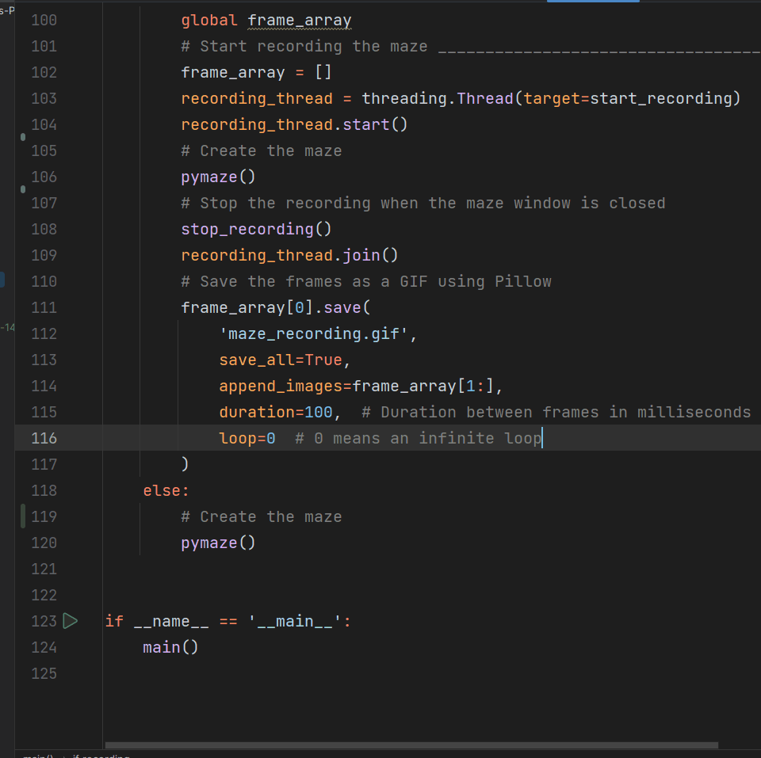
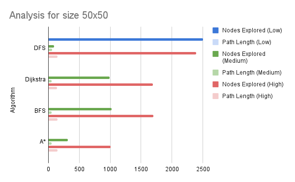

# Final Report - Path Finders and A* Algorithm
* **Author**: Pranchal Shah
* **GitHub Repo**: [5008 Repo](www.github.com/cyber-shah/5008-Project) Also refer [Main Repo](https://github.com/cyber-shah/CS-5008/tree/mainn/final-research-PathFinders-Python)
* **Semester**: Summer 2023
* **Languages Used**: C and Python


# 1 - Abstract

This report aims to comprehensively explore the implementation and performance of A* pathfinding algorithm and compare it with other pathfinding algorithms. The algorithms covered in this report are, Depth First Search, Breadth First Search, Dijkstra's Algorithm, and A* Algorithm. Each algorithm will be scrutinized in terms of theoretical foundations, practical implementation details, rigorous testing, and insightful discussions. The overarching goal is to gain a profound understanding of these A* algorithms' inner workings and their efficacy across various scenarios.

The report delves into the nuances of each algorithm, dissecting their strengths and weaknesses, and uncovers their optimal use cases. Thorough testing is conducted using a diverse set of criteria, including the shortest path determination, nodes explored, time and memory utilization, and adaptability to distinct graph configurations. The selected testing conditions encompass a spectrum of scenarios, ranging from straightforward weighted graphs to intricate mazes replete with obstacles.

As we progress through this exploration, the report will provide clarity on the reasons behind the chosen testing criteria and conditions, grounding our analysis in a solid rationale. Through this holistic investigation, readers will gain not only a deep comprehension of these fundamental pathfinding techniques but also insights into their applicability across real-world situations.

<!-- The algorithms are tested on the following criteria:
1. Shortest path
2. Nodes explored to find the shortest path
3. Time taken to find the shortest path
4. Memory used to find the shortest path
5. Performance on different graphs
6. Performance on different grid sizes
7. Performance on different obstacles
8. Performance on different edge weights
9. Varying start and end nodes

The algorithms are tested on the following conditions:
1. A simple graph weighted edges
2. A grid of nodes each with uniform edge weight and no obstacles and a pretty straight forward shortest path
3. A maze with obstacles and many shorter paths -->


# 2 - Introduction


### <u> 2.1 - Why Path Finding? </u>
Path finding has been a very important problem in computer science. It has been used in many applications such as logistics planning, the least cost call or IP routing, and gaming simulation. 
I got really interested in it when I learned that a logistics company (UPS) collected years of data and used algorithms to navigate better.
UPS says it saved 10 million gallons of fuel, avoided emission of 20,000 tons of CO2, and delivered 350,000 more packages a year, just due to efficient path finding!
 <sup>[1](#reference-1)</sup>


I was also interested in it because I am largely interested in video games and I wanted to learn how video games work. I also wanted to learn how self driving cars work. I learned that path finding is a very important part of both of these applications, and it solves a very important problem. A problem that we as humans encounter almost every day.


 

> Fig. 1  <sup>[2](#reference-1)</sup>
Shows how path finding usually works, it navigates inside a graph and uses edges and nodes to find the shortest path.


### <u> 2.2 - What is Path Finding? </u>
Path finding is the process of finding a path between two points in a graph.
A graph is a data structure that consists of nodes and edges. The nodes are the points in the graph, and the edges are the connections between the nodes. The edges can be weighted or unweighted. The weight of an edge is the cost of traversing that edge. The cost can be anything such as distance, time, fuel, etc. The edges can also be directed or undirected. The directed edges are one way, and the undirected edges are two-way.

The goal of path finding is to determine the shortest path between two nodes in a graph. The path can be defined as the sequence of nodes that need to be traversed to reach the destination node from the source node.  

### <u> 2.3 - How do computers find paths? </u>
A computer starts at a source node and then starts 'scanning' or 'exploring' the graph. It scans the graph by exploring the nodes and edges. It explores the nodes and edges by traversing them. The computer traverses the nodes and edges by following the edges. The computer follows the edges by selecting the edge with the lowest cost. 

An analogy to it would be like a blind person trying to find the shortest path between two points. Instead of using his eyes to see the path, he uses his hands to feel the path. He follows on one path and then feels the edges to see if there is a better path. If there is a better path, he follows that path. He keeps doing this until he reaches the destination.

### <u> 2.4 Algorithms covered </u>
The algorithms covered in this report are:
1. Depth First Search (DFS)
2. Breadth First Search (BFS)
3. Dijkstra's Algorithm (Dijkstra)
4. A* Algorithm (A*)


# 3 - Background
Graph traversal algorithms form the backbone of various computational processes, from deciphering networks to enabling efficient path-finding. These algorithms are instrumental in navigating the intricate web of connections that graphs represent. One fundamental class of graph traversal algorithms includes Depth-First Search (DFS), which excels in exploring the depths of a graph's structure.

In this section, we will delve into the theoretical foundations of DFS, its operational principles, and its applicability across various scenarios. By understanding DFS in the context of graph traversal algorithms, we can appreciate its unique strengths and limitations as we delve deeper into its mechanics.

Each algorithm is divided into the following sections:
1. History
2. Overview of how it works
3. Advantages
4. Disadvantages
5. Pseudo code

The algorithms can be divided into two parts here: 1 that help us find out IF a path exists and 2 that help us find the SHORTEST path. The algorithms that help us find out IF a path exists are: DFS and BFS. The algorithms that help us find the SHORTEST path are: Dijkstra's Algorithm and A* Algorithm.

## 3.1 - The Path Existence Problem

The two algorithms that help us find out IF a path exists are: DFS and BFS. 
> All the GIFs shown in this section are made by me, unless otherwise stated. 
> Kindly note that the algorithms have been implemented by me and pygame is used to create animations. The pygame animation code can be found here: [pyGame_Vizs.py](vizs/pyGame_Vizs.py)

### 3.1.1 - Depth First Search (DFS)
   1. **_History_**: 
      - Depth-First search dates back to the 19th century. It was first used by French mathematician Charles Pierre Trémaux as a strategy for solving mazes. <sup>[3](#reference-1)</sup>
      - DFS is pretty much the background for most of the modern day path finding algorithms. From Bellman Ford to Dijkstra to A* to Prim's Algorithm, have all built on top of DFS.
      - Its simplicity and efficiency makes it a very popular algorithm. It is also very easy to implement.
   2.  **Overview of how it works**:  
       - Depth-First Search is a graph traversal algorithm that starts at a source node and explores the graph by traversing the edges. 
       - It follows a single path until it reaches a dead end. It then backtracks to the previous node and explores the next path. It keeps doing this until it reaches the destination node. 
       - It then backtracks from the destination node to the source node to find the shortest path. It uses a stack to keep track of the nodes that need to be explored. It uses a parent array to keep track of the path. The parent array is used to backtrack from the destination node to the source node. The parent array is also used to find the number of nodes explored to find the shortest path.
       - 
       - > Fig 2. The above GIF shows the order in which DFS explores the nodes before reaching the destination node.
   3.  **_Advantages_**: 
       - The advantage of DFS is that it is basic to implement. 
       - It is also very fast and uses very little memory. 
       - It can quickly determine if a graph has cycles.
   4. **_Disadvantages_**: 
      - It does not guarantee the shortest path. 
      - It can get stuck in a loop. 
      - The other disadvantage is that it may keep moving down the wrong path and may be too late to backtrack towards the right path.
   5. **_Use Cases_**:
      - DFS is used in maze generation algorithms.
      - It is also used in topological sorting.
      - DFS is used in finding connected components in a graph.
      - It is also used in cycle detection in a graph.
   6. **_Pseudo code_**:
      ```
      DFS(Graph,vertex v)
         Stack S
         for each vertex u, set visited[u] := false;
         push S, v;
         while (S is not empty) do
            u := pop S;
            if (not visited[u]) then
               visited[u] := true;
               for each unvisited neighbor w of u
                  push S, w;
      ```


## 3.2 - The Shortest Path Problem
So by now we know how to solve the question of `is there a path between A to B?`. Now the next two algorithms will help us solve the question of `what is the shortest path between A to B?`.

**_Use Cases_**:
1. ***BFS***: 
   - It is used to find the shortest path between nodes in a graph, especially when the graph is unweighted or equally weighted. 
   - It can also be used to explore hierarchical structures or levels of depth in graphs, and to determine connected components in a graph.
   - Applications include social networking websites, search engines, network broadcasting, and garbage collection.
2. ***Dijkstra’s Algorithm*** : 
   - It is used to find the shortest path between nodes in a graph, especially when the graph is weighted. 
   - It can also be used for routing and navigation systems, network routing protocols, and resource management and allocation.
   - Applications include GPS navigation systems, network routing systems, and maps.
3. ***Astar***: 
   - It is an extension of Dijkstra’s algorithm that uses a heuristic function to guide the search towards the goal node. 
   - It can also be used for telecommunication networks, GPS navigation systems, network routing, and pathfinding in video games and robotics.
  
### 3.2.1 - Breadth First Search
1. **_History_**:  
      - "BFS and its application in finding connected components of graphs were invented in 1945 by Konrad Zuse, in his (rejected) Ph.D. thesis on the Plankalkül programming language, but this was not published until 1972." <sup>[4](#reference-2)</sup>
      - " It was reinvented in 1959 by Edward F. Moore, who used it to find the shortest path out of a maze, and later developed by C. Y. Lee into a wire routing algorithm (published in 1961)." <sup>[5](#reference-2)</sup>
      - It was later rediscovered by Edsger Dijkstra in 1959. 
      - It is also known as the `Breadth First Traversal` or `Breadth First Walk`.
      - It is a graph traversal algorithm that starts at a source node and explores the graph by traversing the edges.
2.  **_Overview of how it works_**: 
       - It operates in a similar way to DFS, but it uses a queue instead of a stack. 
       - It starts from the source node and explores it neighbors in `layers`. Layers are nothing but the nodes that are at a distance of `n` from the source node. So the first layer contains nodes that are at a distance of 1 from the source node. The second layer contains nodes that are at a distance of 2 from the source node and so on.
       - It explores the first layer first, then the second layer and so on. This means that nodes closer are explored first and nodes farther away are explored later.
        
            > Fig 3. The above GIF shows the order in which BFS explores the nodes before reaching the destination node.
3. **_Advantages_**: 
      - BFS is guaranteed to find the shortest path between the source node and the destination node.
      - If the graph is connected, then BFS can be used to find the shortest path between all the nodes in the graph.
      - It explores the graph in layers which can be useful if we need to analyze the neighbors.
      - It does not visit a node more than once.
4. **_Disadvantages_**: 
      - It is less suitable for weighted graphs. In a weighted graph, where edges have different costs or distances, the standard BFS will not necessarily find the shortest path. This is because BFS explores nodes in layers, and the order in which nodes are explored might not correspond to the shortest path.
      - It uses more memory than DFS.
5. **_Pseudo code_**:
      ```
      BFS(Graph, start_vertex)
         Queue Q
         visited = set()
         enqueue Q, start_vertex
         visited.add(start_vertex)
         while Q is not empty do
            vertex = dequeue Q
            for each neighbor w of vertex do
               if w is not in visited then
                  visited.add(w)
                  enqueue Q, w
      ```

### 3.2.2 - Dijkstra's Algorithm
1. **_History_**:  
      - Dijkstra's Algorithm was invented by Edsger Dijkstra in 1956. The technique first appeared as a solution to the problem of finding the shortest path between nodes in a weighted graph.
      - It has been widely used in real-world applications, including routing in computer networks and navigation systems.
      - It is also known as the `Shortest Path First Algorithm`.
      - It was invented to solve the problem of finding the shortest path between nodes in a weighted graph.
2. **_Overview of how it works_**:
      - Dijkstra's Algorithm is a graph traversal algorithm that starts at a source node and explores the graph by traversing the edges. It is mainly used to find the shortest path between nodes in a weighted graph. 
      - It is similar to BFS, but uses a concept called `edge relaxation`. Which means that it relaxes the edges of the graph by updating the distance of the nodes.
      - While visiting nodes it maintains a distance array which stores the distance of each node from the source node. Initially, the distance of all the nodes is set to infinity. And the distance of the source node is set to 0. 
      - These distances are updated as the algorithm progresses.
      - The process ends when all the nodes have been visited and returns a list of shortest distances from the source node to all the other nodes.   
    
    > Fig 4. The above GIF shows the order in which Dijkstra's Algorithm explores the nodes before reaching the destination node.
3. **_Advantages_**: 
   - Dijkstra's Algorithm is guaranteed to find the shortest path between the source node and the destination node.
   - The basic concept is straightforward to understand and implement.
   - It is also very efficient.
4. **_Disadvantages_**:
   - Limited to Positive Weights: Dijkstra's algorithm is not well-suited for graphs with negative-edge weights, as negative cycles can lead to incorrect results or cause the algorithm to fail.
   - Inapplicability to Negative Weights: The algorithm's reliance on selecting the minimum distance can break down when dealing with graphs containing negative-edge weights.
   - Potential Inefficiency on Large Graphs: While Dijkstra's algorithm provides optimal solutions, it might not be the most efficient choice for large graphs due to its time complexity.
5. **_Pseudo code_**:
      ```
      1. Initialize all nodes with distance INFINITY, except the source node with distance 0.
      2. Create a priority queue (min-heap) and insert the source node with distance 0.
      3. While the priority queue is not empty:
         3.1 Extract the node with the minimum distance from the priority queue.
         3.2 For each adjacent node of the extracted node:
               3.2.1 Calculate a tentative distance by adding the edge weight to the extracted node's distance.
               3.2.2 If the tentative distance is less than the current distance of the adjacent node:
                     3.2.2.1 Update the adjacent node's distance with the tentative distance.
                     3.2.2.2 Enqueue the adjacent node into the priority queue.
      4. The distances now hold the shortest paths from the source node to all other nodes.
      ```

### 3.2.3 - A* Algorithm
1.  **_History_**:
      - A* was created by Peter Hart, Nils Nilsson and Bertram Raphael of Stanford Research Institute (now SRI International) in 1968. It was first published in the 1968 paper "A Formal Basis for the Heuristic Determination of Minimum Cost Paths".
      - It was created to solve the problem of finding the shortest path between nodes in a weighted graph, in a more efficient way.
      - It is a combination of Dijkstra's Algorithm and Greedy Best First Search.
2. **_Overview of how it works_**:
      - A* shares similarities with Dijkstra's Algorithm but introduces a pivotal concept known as `heuristics`.
      - Heuristics involve estimating the distance between two nodes, specifically between the current node and the destination node. This estimation guides the algorithm in its exploration.
      - Unlike exhaustive searches, heuristic algorithms, like A*, selectively explore the most promising routes. They leverage an educated guess to determine which path holds the greatest potential.
      - In the animation below, the algorithm prioritizes promising routes, resulting in more efficient exploration while disregarding less viable paths.
      - 
3. **_Advantages_**: 
      - A* boasts notable efficiency due to its effective utilization of heuristics.
     - Through the application of heuristics, A* excels at efficiently finding the shortest path in weighted graphs, often outperforming Dijkstra's Algorithm.
      - Notably, A* guarantees the discovery of the shortest path between the source and destination nodes when an admissible and consistent heuristic is employed.
4. **_Disadvantages_**:
      - A* does have limitations. Its guarantee of finding the shortest path hinges on using an admissible, consistent, and monotonic heuristic.
      - Another disadvantage includes the fact that it is not well-suited for graphs with negative edge weights, as negative cycles can lead to incorrect results or cause the algorithm to fail.
5. **_Pseudo code_**:
      ```
    1. Initialize all nodes with distance INFINITY, except the source node with distance 0.
    2. Create a priority queue (min-heap) and insert the source node with distance 0.
    3. While the priority queue is not empty:
        3.1 Extract the node with the minimum distance from the priority queue.
        3.2 For each adjacent node of the extracted node:
                3.2.1 Calculate a tentative distance by adding the edge weight to the extracted node's distance.
                3.2.2 If the tentative distance is less than the current distance of the adjacent node:
                    3.2.2.1 Update the adjacent node's distance to the tentative distance.
                    3.2.2.2 Set the adjacent node's parent to be the extracted node.
                    3.2.2.3 Add the adjacent node to the priority queue with its updated distance.
    4. Return the shortest path from source to destination by following the parent pointers from destination to source.
    ```


# 4 - Implementation Details
Initially, the decision was made to implement all the algorithms in C, driven by concerns related to speed and efficiency. Given its status as a low-level programming language, C emerged as the natural choice for this purpose. The complete C implementation can be accessed within the [c-code](c-code) directory. 
 
However, as the implementation of Dijkstra's algorithm progressed, the necessity to subject the algorithms to rigorous testing across a spectrum of mazes and scenarios became apparent. This testing was intended to evaluate their performance under diverse conditions. To facilitate this assessment, the aspiration emerged to create animations that would offer insights into how the algorithms explore nodes, quantify the number of nodes each algorithm traverses before identifying the shortest path, and much more. In essence, the goal was to **visualize** the algorithms' behavior.

> In general, all the python implementations are higher in completeness and functionality than the C implementations. A lot of functionality was added to the python implementations while the C implementations were being ported to python. So python implementations are an improvement over the C implementations.

This is because I started with the C implementations and then moved to Python. So the C implementations are not as complete as the Python implementations. But they help in understanding the memory management and the data structures used in the Python implementations.

However, as the implementation of Dijkstra's algorithm progressed, the necessity to subject the algorithms to rigorous testing across a spectrum of mazes and scenarios became apparent. This testing was intended to evaluate their performance under diverse conditions. To facilitate this assessment, the aspiration emerged to create animations that would offer insights into how the algorithms explore nodes, quantify the number of nodes each algorithm traverses before identifying the shortest path, and much more. In essence, the goal was to visualize the algorithms' behavior.

Therefore, the shift to Python was motivated by the intention to holistically comprehend algorithmic behavior through animations, leveraging Python's high-level capabilities and visualization tools, while the initial implementation in C addressed concerns of speed and efficiency.

## 4.1 - Data Structures

Initially, the structs/classes that hold the graphs and nodes were based on XY coordinate system, however, when I started using libraries like Matplotlib and Pygame, I realized that it would be easier to use a matrix to represent the graph. So I changed the structs/classes to use a matrix instead of XY coordinates.

### 4.1.1 - Nodes
The node data structure is responsible to hold the information about the node, heuristics, distance, parent and position. The node is represented as a struct in C and a class in Python. The C implementation of the node can be found here [Node in C](c-code/structs/Node.h).

```C
struct Node {
    char *name;
    int index;
    int distance;
} typedef Node;
```

The Python implementation of the node can be found here [Node in Python](model/Node.py). It holds the following attributes:
- `index` - The index of the node in the graph.
- `name` - name of the node.
- `parent` - The parent node of the current node.
- `g` - cost from the start node to the current node
- `h` - The heuristic value of the node.
- `f` - total estimated cost of the node. $f(n) = g(n) + h(n)$

> A notable difference between the C and Python implementations is the python implementations are a lot more object-oriented. The C implementations are more procedural. Apart from that, they are also a big upgrade in terms of functionality and completeness.

```python
class NodeRC:

    def __init__(self, name,
                 row=None, column=None, parent=None,
                 g=None, h=None, f=None):
        self.index = None
        self.name = name
        self.parent = parent
        self.g = g
        self.h = h
        self.f = f
        if row is None or column is None:
            self.row = 0
            self.column = 0
        else:
            self.row = row
            self.column = column
```
Apart from getters and setters for all the attributes, the class also has the a method called `get_neighbors` that returns a list of nodes that are connected to the current node.
```Python
    def get_neighbors(self, graph):
        # a list of nodes index
        neighbors = []
        for i in range(graph.number_of_nodes):
            if graph.adjacency_matrix[self.index][i] != float('inf') and i != self.index:
                neighbors.append(graph.get_node_via_index(i))
        return neighbors
        
```

> Another major difference is the use of `rows` and `columns` to represent the nodes instead of using XY coordinates. This was done to make it easier to use libraries like Matplotlib and Pygame to visualize the graph. This decision was made after the C implementation was completed. The C implementation uses XY coordinates to represent the nodes.

### 4.1.2 - Graphs
The graph data structure is responsible to hold the nodes and edges. The graph is represented as a matrix, where each row and column represents a node. The value of the matrix at the row and column index represents the weight of the edge between the two nodes. If the value is `inf`, it means that there is no edge between the two nodes.
The C implementation of the graph can be found here [Graph in C](c-code/structs/Graph.h).
```C
struct Graph {
    int numberOfNodes;
    int adjacencyMatrix[MAX_NODES][MAX_NODES];
    Node *nodes[MAX_NODES];
} typedef Graph;
```

The python implementation of the graph can be found here [Graph in Python](model/Graph.py). It holds the following attributes:
``` Python
class GraphRC:
    def __init__(self):
        self.number_of_nodes = 0
        self.number_of_edges = 0
        # Use a list of lists for the adjacency matrix
        self.adjacency_matrix = []
        # Use a dictionary key, value = (x pos, y pos), node
        self.nodesDictionary = {}
        # Use a dictionary key, value = index, node
        self.nodeIndices = {}
        # Use a dictionary key, value = name, node
        self.nodeNames = {}
```

Apart from getters and setters for all the attributes, the class also has the following methods:

``` Python
def add_node(self, node):
      # 1. Update the node's index
      node.set_index(self.number_of_nodes)
      # 2. Update the graph's dictionary of nodes, adding   the new node
      self.nodesDictionary[(node.row, node.column)] = node
      self.nodeIndices[node.get_index()] = node
      self.nodeNames[node.get_name()] = node
      # 3. Update the graph's adjacency matrix
      self.number_of_nodes += 1
      # Update the adjacency matrix with a new row and      column for the new node
      new_row = [float('inf')] * self.number_of_nodes
      for row in self.adjacency_matrix:
          row.append(float('inf'))
      self.adjacency_matrix.append(new_row)
      # edge from node to itself is 0
      self.set_edge_weighted(node, node, 0)

def set_edge_weighted(self, node1, node2, weight):
      # get the index of each node
      index1 = self.get_node_via_row_column(node1.row,      node1.column).get_index()
      index2 = self.get_node_via_row_column(node2.row,      node2.column).get_index()
      # set the edge in the adjacency matrix
      self.adjacency_matrix[index1][index2] = weight
      self.adjacency_matrix[index2][index1] = weight
      # update the number of edges
      self.number_of_edges += 1
```

One notable difference was the use of a dictionary to store the nodes. This was done to make it easier to access the nodes. The dictionary uses the node name as the key and the node object as the value. This makes it easier to access the node object using the name of the node. The dictionary can be accessed using the `nodeNames` attribute of the graph object.

### 4.1.3 - Stacks and Queues
The algorithms also use stacks and queues to keep track of the nodes that are visited.
The C implementation uses stacks and queues developed in this class in the earlier assignments. The stacks and queues can be found here [Stacks in C](c-code/structs/mystack.h) and [Queues in C](c-code/structs/myQueue.h) respectively.

The python implementation uses the built in stacks and queues from the `collections` library. 


## 4.2 - Depth First Search

- C implementation can be found here [DFS in C](c-code/algorithms/DFS.h)
- 🐍 Python implementation can be found here [DFS in Python](algorithms/DFS.py)

### 4.2.1 - Recursive Approach

The C implementation of DFS was based on recursion. The recursive approach was selected due to its simplicity and elegance. There's a helper function that is called recursively to visit all the nodes in the graph. The helper function takes in the graph, the source node index, and a boolean array that keeps track of the visited nodes.
The recursive implementation can be found below:

```C
void dfsHelper(Graph *graph, int sourceNodeIndex, bool visited[]) {
    // base case - set the node to visited
    visited[sourceNodeIndex] = true;

    // recursive case - if there is an adjacent node that is not visited, then visit it
    for (int i = 0; i < graph->numberOfNodes; ++i) {
        if (graph->adjacencyMatrix[sourceNodeIndex][i] != INF && !visited[i]) {
            dfsHelper(graph, i, visited);
        }
    }
}

void dfs_recursive(Graph *graph, int sourceNodeIndex) {
    bool visited[MAX_NODES] = {false};
    dfsHelper(graph, sourceNodeIndex, visited);
}
```

### 4.2.2 - Stack Approach

The approach to implementing DFS was to leverage a stack data structure to store the nodes that were visited. The stack was implemented as a linked list, with each node containing a pointer to the next node in the stack. The stack was initialized with the source node, and the algorithm proceeded to pop nodes from the stack, marking them as visited, and pushing their unvisited neighbors onto the stack. This process continued until the destination node was reached, or the stack was empty. If the destination node was reached, the algorithm would backtrack to the source node, marking the shortest path. If the stack was empty, the algorithm would terminate, indicating that no path existed between the source and destination nodes.

```Python
def dfs_destination(graph, source_node_name, destination_node_name):
    source_node_index = (graph.get_node_via_name
                         (source_node_name).index)
    destination_node_index = (graph.get_node_via_name
                              (destination_node_name).index)

    stack = deque()
    visited = [False] * graph.number_of_nodes
    distances_list = []  # to store the order of visited nodes
    parent_map = {}  # To store parent nodes for backtracking

    visited[source_node_index] = True
    stack.append(source_node_index)
    distances_list.append(source_node_index)

    while stack:
        current_node_index = stack.pop()

        if current_node_index == destination_node_index:
            break

        for i in range(graph.number_of_nodes):
            if graph.adjacency_matrix[current_node_index][i] != float('inf') and not visited[i]:
                visited[i] = True
                stack.append(i)
                distances_list.append(i)
                parent_map[i] = current_node_index  # Store parent information

    if destination_node_index not in parent_map:
        return distances_list, []

    shortest_path = build_shortest_path(parent_map, source_node_index, destination_node_index)
    return distances_list, shortest_path
```

Then the function called `build_shortest_path` is called to create a list of indices of nodes that represent the shortest path between the source and destination nodes. The function takes in the parent map, the source node index, and the destination node index. The function iterates through the parent map, starting from the destination node, and appends the current node index to the shortest path list. The function terminates when the current node index is equal to the source node index. The shortest path list is then reversed to obtain the correct order of nodes.

```Python
def build_shortest_path(parent_map, source_node_index, destination_node_index):
    current_node_index = destination_node_index
    shortest_path = []

    while current_node_index != source_node_index:
        shortest_path.append(current_node_index)
        current_node_index = parent_map[current_node_index]

    shortest_path.append(source_node_index)
    shortest_path.reverse()
    return shortest_path
```

## 4.3 - Breadth First Search
 
- C implementation can be found here [BFS in C](c-code/algorithms/BFS.h)
- 🐍 Python implementation can be found here [BFS in Python](algorithms/BFS.py)


The approach to implementing BFS was to leverage a queue data structure to store the nodes that were visited. 
This function performs BFS on the graph and returns the order of explored nodes and shortest path from source node

    1. Initialize a queue and a visited array
    2. Mark the source node as visited and enqueue it
    3. While queue is not empty
        3.1. Dequeue a node from the queue
        3.2. If the dequeued node is the destination node, break the loop
        3.3. Else visit all the adjacent nodes of current node
            3.3.1. Enqueue all the unvisited adjacent nodes and mark them as visited
    4. Repeat step 3 until queue is empty

```Python
def bfs_destination(graph, source_node_name, destination_node_name):
    source_node_index = graph.get_node_via_name(source_node_name).index
    destination_node_index = graph.get_node_via_name(destination_node_name).index

    queue = deque()
    visited = [False] * graph.number_of_nodes
    explored_nodes_indices = []  # To store the order of visited nodes
    parent_map = {}  # To store parent nodes for backtracking

    visited[source_node_index] = True
    queue.append(source_node_index)
    explored_nodes_indices.append(source_node_index)

    while queue:
        current_node_index = queue.popleft()

        # if destination node is found, break the loop
        if current_node_index == destination_node_index:
            break

        # else visit all the adjacent nodes of current node
        # append them to the queue and mark them as visited
        for i in range(graph.number_of_nodes):
            if graph.adjacency_matrix[current_node_index][i] != float('inf') and not visited[i]:
                visited[i] = True
                queue.append(i)
                explored_nodes_indices.append(i)
                parent_map[i] = current_node_index  # Store parent information

    # If destination node is not found, return shortest path as empty list
    if destination_node_index not in parent_map:
        return explored_nodes_indices, []

    # Else build the shortest path and return it
    shortest_path = build_shortest_path(parent_map, source_node_index, destination_node_index)
    return explored_nodes_indices, shortest_path
```

Apart from the above function, we also implemented a function to build the shortest path from the parent map. It takes in the parent map, the source node index, and the destination node index. The function iterates through the parent map, starting from the destination node, and appends the current node index to the shortest path list. The function terminates when the current node index is equal to the source node index. The shortest path list is then reversed to obtain the correct order of nodes.

```Python
def build_shortest_path(parent_map, source_node_index, destination_node_index):
    current_node_index = destination_node_index
    shortest_path = []

    while current_node_index != source_node_index:
        shortest_path.append(current_node_index)
        current_node_index = parent_map[current_node_index]

    shortest_path.append(source_node_index)
    shortest_path.reverse()
    return shortest_path
```


## 4.4 - Dijkstra's Algorithm

- C implementation can be found here [Dijkstra in C](c-code/algorithms/Djikstra.h)
- Python implementation can be found here [Dijkstra in Python](algorithms/Dijkstra.py)

### 4.4.1 - Using Priority Queues
The approach to implementing Dijkstra was to leverage a priority queue data structure to store the nodes that were visited.  The priority queue is implemented using a min heap. The function performs Dijkstra on the graph and returns the order of explored nodes and shortest path from source node.

```Python
def dijkstra_path(graph, source_node_name, destination_node_name):
    total_nodes = graph.number_of_nodes
    source_index = graph.get_node_via_name(source_node_name).get_index()
    destination_index = graph.get_node_via_name(destination_node_name).get_index()
    source_node = graph.get_node_via_index(source_index)

    priority_queue = [(0, source_index)]  # (distance, node_index)
    visited_list = [False] * total_nodes
    # distance list init
    distance_list = [float('inf')] * total_nodes
    for neighbor in source_node.get_neighbors(graph):
        neighbor_index = neighbor.get_index()
        distance_list[neighbor_index] = graph.get_edge(source_node, neighbor)
        heapq.heappush(priority_queue, (distance_list[neighbor_index], neighbor_index))
    distance_list[source_index] = 0

    explored_nodes_indexes = []
    previous_nodes = [-1] * total_nodes

    while priority_queue:
        # Extract the node with the minimum distance from the priority queue
        current_distance, current_node_index = heapq.heappop(priority_queue)
        explored_nodes_indexes.append(current_node_index)
        current_node = graph.get_node_via_index(current_node_index)
        visited_list[current_node_index] = True

        # If the destination node is visited, we can stop the algorithm
        if current_node_index == destination_index:
            break

        # 2. Loop over all of its adjacent nodes.
        for neighbour in current_node.get_neighbors(graph):
            neighbour_index = neighbour.get_index()
            edge_weight = graph.get_edge(current_node, neighbour)
            new_distance = distance_list[current_node_index] + edge_weight
            neighbor_distance = distance_list[neighbour_index]

            # 2.1 Relax all adjacent unvisited nodes.
            if visited_list[neighbour_index] is False and neighbour_index != source_index:
                if new_distance < neighbor_distance:
                    # 2.2 If the new distance is less than the current distance, update the distance.
                    heapq.heappush(priority_queue, (new_distance, neighbour_index))
                    previous_nodes[neighbour_index] = current_node_index
                    distance_list[neighbour_index] = new_distance

    shortest_path = []
    current_node = destination_index
    while current_node != -1:
        shortest_path.insert(0, current_node)
        current_node = previous_nodes[current_node]

    return distance_list, explored_nodes_indexes, shortest_path
```


### 4.4.2 - Using Arrays
However, the C implementation of Dijkstra does not use a priority queue;
instead it uses a simple array to store the nodes that were visited.
The array is then passed into a function called `find_min_node`
which returns the index of the node with the smallest distance.
The function performs Dijkstra on the graph and returns the order of explored nodes and shortest path from source node.

```C
int* Dijkstra(int sourceNode, Graph *graph, bool print) {
    
    int totalNodes = graph->numberOfNodes;
    
    // initialize all the visited_list nodes to false.
    bool* visited_list = (bool*) malloc(sizeof(bool) * totalNodes);
    // array of nodes - to store the distance from the source node.
    int* distances_list = (int*) malloc(sizeof(int) * totalNodes);


    // initialize the distances array and visited array.
    // They all mean from the source Node.
    for (int i = 0; i < totalNodes; i++) {
        // if the distance is not INF, then it is the distance.
        if (graph->adjacencyMatrix[sourceNode][i] != INF) {
            distances_list[i] = graph->adjacencyMatrix[sourceNode][i];
        } else {
            distances_list[i] = INF;
        }
        visited_list[i] = false;
    }
    // distance of source node from itself is 0.
    distances_list[sourceNode] = 0;

    // loop through all the nodes
    for (int i = 0; i < (totalNodes - 1); ++i) {
        // finds the node with the minimum distance to visit next.
        int minDistanceNode = find_min_distance_node(visited_list, distances_list, totalNodes);

        // mark the node as visited
        visited_list[minDistanceNode] = true;

        // loop through all the nodes.
        for (int j = 0; j < totalNodes; ++j) {
            // relax all the adjacent unvisited nodes. adjacent means distance != INF
            if (visited_list[j] == false && graph->adjacencyMatrix[minDistanceNode][j] != INF && graph->adjacencyMatrix[minDistanceNode][j] != 0) {
                int newDistance = distances_list [minDistanceNode] 
                                  + graph->adjacencyMatrix[minDistanceNode][j];
                if (newDistance < distances_list[j]) {
                    // update the distance
                    distances_list[j] = newDistance;
                }
            }
        }
    }
    free(visited_list);

    if (print == true) {
        print_shortest_path(distances_list, sourceNode, graph);
    }
    return distances_list;
}
```


Due to the lack of priority queue in the C implementation, the time complexity of the C implementation is $O(n^2)$ while the Python implementation is $O(n log n)$.  This is because the C implementation has to loop through all the nodes to find the node with the smallest distance.  The Python implementation uses a priority queue which is implemented using a min heap.

```C
int find_min_distance_node(const bool visited_list[], const int distances_list[], int totalNodes) {
    int minDistance = INF;
    int node_index = -1;

    // for all nodes if unvisited and distance less than minDistance.
    for (int i = 0; i < totalNodes; i++) {
        if (visited_list[i] == false && distances_list[i] <= minDistance && distances_list[i] != 0) {
            minDistance = distances_list[i];
            node_index = i;
        }
    }
    return node_index;
}
```

## 4.5 - A* Path finder
The python implementation can be found here: [A* Path Finder in Python](algorithms/A_star.py)

### 4.5.1 - Understanding A* Path Finder
Like we saw earlier, A* algorithms are pretty similar to Dijkstra except the fact that they have a secret function called `heuristic` function which simply allows us to explore nodes on in the `direction` of the destination node. More on Heuristic functions later.

Apart from the heuristics, there are a few additional components that are required to implement A* pathfinder.
For every node, we need to keep track of the following :
- `g` - the distance from the source node to the current node.
- `h` - the heuristic distance from the current node to the destination node.
- `f` - the sum of `g` and `h`. This is the distance from the source node to the destination node via the current node.
- `parent` - the previous node that was visited before the current node.

The implementation uses a concept of `closed_set` and an `open_set`. The `closed_set` is a set of nodes that have been visited. The `open_set` is a set of nodes that are yet to be visited. The `open_set` is implemented using a priority queue. The priority queue always returns the node with the smallest `f` value. The `open_set` is initialized with the source node. The `closed_set` is initialized as an empty set.

### 4.5.2 - Implementation
There are two ways in which the algorithm can end:
- If we find the destination node, we can stop the algorithm.
- If the `open_set` = unvisited reachable nodes are empty, we can stop the algorithm.
  
So let's understand how it is implemented step by step.
1. ***Part 1 - Initialize*** :
   Similar to Dijkstra, mark all nodes at `inf` distance away from the starting node. The starting node itself is at distance 0.
   ```Python
    open_unvisited_set = []  # unvisited nodes
    closed_visited_set = set()  # visited nodes
    explored_nodes_indices = []  # explored nodes
    ```
2. ***Part 2 - Set up the source node*** :
   The `g` value for the source node is set to 0. The `h` value is set to the heuristic distance from the source node to the destination node. The `f` value is the sum of `g` and `h`. The source node is then pushed into the `open_unvisited_set` which is a priority queue. This priority queue always returns the node with the smallest `f` value.
   
   ```Python
      source_node.g = 0
      source_node.h = heuristic(source_node, destination_node)
      source_node.f = source_node.g + source_node.h
      heapq.heappush(open_unvisited_set, (source_node.f, source_node))
    ```
3. ***Part 3 - begin the exploration*** :
   Pop the node with lowest `f` value from the `open_unvisited_set`. Make this node the focus for further steps. We check if this focus node is the destination node, if yes, we return the path. If not, we add the focus node to the `closed_visited_set` and add the index of the focus node to the `explored_nodes_indices` list.
   ```Python
    while open_unvisited_set:
      # get the current node from the open_unvisited_set
      # with the lowest f_score
      f, current_node = heapq.heappop(open_unvisited_set)
      closed_visited_set.add(current_node)
      explored_nodes_indices.append(current_node.index)

      # if destination node is found ______________________________
      if current_node.index == destination_node.index:
            break
   ```
4. ***Part 4 - Explore the neighbours*** :
      For the chose nodes, we explore all the neighbours. For each neighbour, we calculate the `g` value, `h` value and `f` value. 
      Hence, for all neighbors of the current node, we do the following:
      1. Calculate the `tentative_g` value which is the `g` value of the current node + the distance between the current node and the neighbor.
      2. If is already visited and the `tentative_g` value is greater than the `g` value of the neighbor, we skip it.
      3. If the neighbour is not already visited OR tentative_g is less than the `g` value of the neighbor, we update the `g` value, `h` value and `f` value of the neighbor.
      4. If the neighbor is not in the `open_unvisited_set`, we add it to the `open_unvisited_set`.
      ```Python
      for neighbor in current_node.get_neighbors(graph):
            # calculate tentative_g
            tentative_g = current_node.g + graph.get_edge(current_node, neighbor)

            # if neighbor is visited and the tentative_g > neighbor.g,
            # we already have a better path
            if neighbor in closed_visited_set and tentative_g >= neighbor.g:
                continue
      ```
5. ***Part 5 - A* Intelligence*** :
      This is where the intelligence of A* comes in. It compares the `g` values of the neighbors and chooses the one with the lowest `f` value. This is the node that is added to the `open_unvisited_set`.
      ```Python
            # if the neighbor is not already visited or
            # the tentative_g is less than the neighbor.g
            if neighbor not in open_unvisited_set or tentative_g < neighbor.g:
                # update all the values of neighbour to this new path
                neighbor.g = tentative_g
                neighbor.h = heuristic(neighbor, destination_node)
                neighbor.f = neighbor.g + neighbor.h
                neighbor.parent = current_node

                # if neighbour is not in the unvisited set, add it to visit again
                if neighbor not in open_unvisited_set:
                    heapq.heappush(open_unvisited_set, (neighbor.f, neighbor))
      ```
6. ***Part 6 - Return the path*** :
      Once the destination node is found, we can return the path. The path is the list of nodes that are in the `closed_visited_set`. The path is then reversed to get the path from the source node to the destination node.
    ```Python
    path = []
    current = destination_node
    while current is not None:
        path.append(current.index)
        current = current.parent
    return explored_nodes_indices, path[::-1]
      ```


### 4.5.3 - Heuristic Functions
The approach of the A* pathfinder is akin to Dijkstra's algorithm, with the distinctive feature of incorporating a heuristic function to estimate the distance from the current node to the destination node. This heuristic guides the A* algorithm in selecting the most promising paths to explore. The heuristic function employed is typically based on various distance metrics.

> The time complexity of A * algorithm totally depends on the heuristic used. The heuristic function must be admissible, meaning it never overestimates the actual cost to get to the nearest goal node. 

> It can vary from $O(VlogV+E)$, where V is the number of nodes in the graph and E is the number of edges - to $O(b^d)$ where $d$ is the depth of the solution and $b$ is the branching factor. The heuristic function is problem-specific and is often domain-specific. 
> $O(b^d)$ is the worst case time complexity when the heuristic function is not admissible.

There are several options for heuristic functions, and the commonly used ones include the Euclidean distance, Manhattan distance, diagonal distance, and weighted heuristics.

1. ***Manhattan distance*** - This heuristic calculates the sum of the absolute differences of the x and y coordinates. It's also known as the L1 norm. When applied in a grid-based environment, where movement is restricted to horizontal and vertical directions, this heuristic provides an estimate of the minimum number of moves required to reach the goal.
   
   $h(A, B) = |x2 - x1| + |y2 - y1|$

2. ***Euclidean Distance Heuristic:*** - This heuristic represents the straight-line distance between two points. It's also referred to as the L2 norm. The Euclidean distance heuristic offers an estimate of the actual distance between the two points and is widely used in pathfinding.
   
   $h(A, B) = \sqrt{(x2 - x1)^2 + (y2 - y1)^2}$

3. ***Diagonal Distance Heuristic:*** - This heuristic calculates the maximum of the absolute differences of the x and y coordinates. It's associated with the L-infinity norm. The diagonal distance heuristically estimates the maximum distance between the two points and is particularly suitable for grid-based environments allowing horizontal, vertical, and diagonal movement.
      
      $h(A, B) = d + (\sqrt{2} - 2) * min(d_x, d_y)$
      
      where $d = max(d_x, d_y)$

4. ***Weighted Heuristic:*** - This heuristic involves a weighted combination of the Manhattan distance and the Euclidean distance. It provides an estimate of the actual distance between two points. The weighted heuristic is useful for grid-based environments where movement can occur in various directions.
   
   $h(A, B) = w_1 * |x2 - x1| + w_2 * |y2 - y1| + w_3 * sqrt((x2 - x1)^2 + (y2 - y1)^2)$
   
   where $w_1 + w_2 + w_3 = 1$

In this project, we have used the Manhattan distance heuristic function. This is because the movement is restricted to horizontal and vertical directions. Hence, the Manhattan distance heuristic provides an estimate of the minimum number of moves required to reach the goal.

```Python
def heuristic(source_node, goal_node):

    return abs(source_node.row - goal_node.row) + abs(source_node.column - goal_node.column)
```

### 4.5.4 - Putting it all together
Hence, the complete implementation of the A* algorithm is as follows:

```Python
def a_star_destination(graph, source_node_name, destination_node_name):
    # instantiate ____________________________________________________
    open_unvisited_set = []  # unvisited nodes
    closed_visited_set = set()  # visited nodes
    explored_nodes_indices = []  # explored nodes

    # Getters ________________________________________________________
    source_node_index = graph.get_node_via_name(source_node_name).index
    destination_node_index = graph.get_node_via_name(destination_node_name).index
    source_node = graph.get_node_via_index(source_node_index)
    destination_node = graph.get_node_via_index(destination_node_index)

    # Setters ______________________________________________________
    source_node.g = 0
    source_node.h = heuristic(source_node, destination_node)
    source_node.f = source_node.g + source_node.h
    heapq.heappush(open_unvisited_set, (source_node.f, source_node))

    # while there are unvisited nodes
    while open_unvisited_set:
        # set operations ____________________________________________
        # get the current node from the open_unvisited_set
        # with the lowest f_score
        f, current_node = heapq.heappop(open_unvisited_set)
        if current_node in closed_visited_set:
            continue
        closed_visited_set.add(current_node)
        explored_nodes_indices.append(current_node.index)

        # if destination node is found ______________________________
        if current_node.index == destination_node.index:
            break

        # for all neighbors _________________________________________
        # else visit all the UNVISITED adjacent nodes of current node
        for neighbor in current_node.get_neighbors(graph):
            # calculate tentative_g
            tentative_g = current_node.g + graph.get_edge(current_node, neighbor)

            # if neighbor is visited and the tentative_g > neighbor.g,
            # we already have a better path
            if neighbor in closed_visited_set and tentative_g >= neighbor.g:
                continue

            # if the neighbor is not already visited or
            # the tentative_g is less than the neighbor.g
            if neighbor not in open_unvisited_set or tentative_g < neighbor.g:
                # update all the values of neighbour to this new path
                neighbor.g = tentative_g
                neighbor.h = heuristic(neighbor, destination_node)
                neighbor.f = neighbor.g + neighbor.h
                neighbor.parent = current_node

                # if neighbour is not in the unvisited set, add it to visit again
                if neighbor not in open_unvisited_set:
                    heapq.heappush(open_unvisited_set, (neighbor.f, neighbor))

    # return the path
    path = []
    current = destination_node
    while current is not None:
        path.append(current.index)
        current = current.parent
    return explored_nodes_indices, path[::-1]


def heuristic(source_node, goal_node):

    return abs(source_node.row - goal_node.row) + abs(source_node.column - goal_node.column)

```

# 5 - Theoretical Analysis

In this section, we will delve into a detailed analysis of the A* algorithm's efficiency, specifically examining its computational complexity in different scenarios and comparing it to other pathfinding algorithms such as Breadth First Search (BFS) and Dijkstra's Algorithm. We will also discuss the algorithm's best, worst, and average-case behaviors.

## 5.1 - Computational Complexity

The computational complexity of an algorithm is a measure of the amount of time and memory required to run the algorithm. It is usually expressed as a function of the input size.

### 5.1.1 - Time Complexity Analysis
1. ***Initialization:*** The initialization step involves setting up various data structures and initial values for nodes. This step takes constant time.
2. ***While loop:*** The while loop iterates over all the nodes in the graph. The number of iterations depends on the number of nodes in the graph. Hence, the time complexity of the while loop is $O(V ∗ logV + E)$, where V is the number of nodes in the graph and E is the number of edges in the graph.
   1. ***Heap Operations:*** The heapq operations (heap pop and heappush) take logarithmic time complexity $(O(log n))$ where n is the number of nodes in the heap.
   2. ***For loop:*** The for loop iterates over all the neighbors of the current node. The number of iterations depends on the number of neighbors of the current node. Hence, the time complexity of the for loop is $O(E)$, where E is the number of edges in the graph.
   3. ***Heuristic Function:*** The heuristic function takes constant time.
3. ***Backtracking*** : The backtracking step involves following the parent pointers from the destination node to the source node to construct the path.
      - in the worst case, where the path has many turns or changes in direction, the backtracking step would require traversing all nodes in the path, which takes $O(V)$ time.

***Combining these complexities:***
1. ***Initialization:*** $O(1)$
2. ***While loop:*** $O(V * log V + E)$
   1. ***For all nodes*** $O(V)$
   2. ***Heap Operations:*** $O(log n)$
   3. ***For loop:*** $O(E)$
   4. ***Heuristic Function:*** $O(1)$
3. ***Backtracking*** : $O(V)$

Overall, the time complexity is dominated by the while loop and the backtracking step, resulting in a worst-case time complexity of $O(V * log V + E)$.

### 5.1.2 - Space Complexity Analysis

The space complexity is primarily determined by the data structures used to store nodes and their attributes:
1. ***Open Set:*** The open set is a priority queue that stores nodes that have been visited but not expanded. The open set can contain at most V nodes, where V is the number of nodes in the graph. Hence, the space complexity of the open set is $O(V)$.
2. ***Closed Set:*** The closed set is a set that stores nodes that have been visited and expanded. The closed set can contain at most V nodes, where V is the number of nodes in the graph. Hence, the space complexity of the closed set is $O(V)$.
3. ***Explored Nodes:*** The explored nodes list stores the indices of all the nodes that have been visited. The explored nodes list can contain at most V nodes, where V is the number of nodes in the graph. Hence, the space complexity of the explored nodes list is $O(V)$.

Overall, the space complexity is dominated by the open set, closed set, and explored nodes list, resulting in a space complexity of $O(V)$.

## 5.2 - Best, Worst, and Average Case Analysis

| Approach      | Time Complexity       | Space Complexity  |
| ---           |----------------       | ---               |
| Best Case     | $O(d)$                | $O(V)$          |
| Worst Case    | $O(V * log V + E)$    | $O(V)$        |
| Average Case  | $O(V * log V + P)$    | $O(V)$        |

### 5.2.1 - Best Case

In the best case, the heuristic consistently provides accurate estimates, leading to the algorithm finding the optimal path quickly. This means that the algorithm only expands the nodes along the optimal path, and does not explore any other nodes. This is possible if the heuristic is admissible and consistent, meaning that it never overestimates the actual cost to reach the goal, and it satisfies the triangle inequality.

Time Complexity: $O(d)$
where d is the depth of the optimal path.

### 5.2.2 - Worst Case

In the worst case, the heuristic consistently provides inaccurate estimates, leading to the algorithm exploring all nodes in the graph. This means that the algorithm behaves like a uniform-cost search or Dijkstra’s algorithm, and does not benefit from any guidance from the heuristic. This can happen if the heuristic is inadmissible, meaning that it overestimates the actual cost to reach the goal.

Time Complexity: $O(V * log V + E)$, where V is the number of nodes in the graph, and E is the number of edges in the graph.

### 5.2.3 - Average Case

In the average case, the heuristic provides a mix of accurate and inaccurate estimates, leading to the algorithm exploring some nodes in the graph. This means that the algorithm behaves somewhere between a uniform-cost search and a greedy best-first search, depending on how good or bad the heuristic is. The average case is hard to analyze precisely, since it depends on many factors such as the graph structure, the start and goal nodes, and the heuristic function.

Time Complexity: $O(V * log V + P)$, where V is the number of nodes in the graph, and P is the number of nodes in the path.

> A point to be noted here is that all the complexities mentioned here refer to the implementation and configuration of the algorithm in this project. The complexities may vary for different implementations and configurations.
> The actual worst case time complexity of the A* algorithm is $O(b^d)$, where b is the branching factor of the graph, and d is the depth of the optimal path. This is because the algorithm may explore all nodes in the graph, and the number of nodes in the graph is $O(b^d)$.

## 5.3 - Comparison with Other Algorithms
In this section, we will compare A* search with two other graph search algorithms: breadth-first search (BFS) and Dijkstra’s algorithm.


| Approach      | Time Complexity       | Space Complexity  |
| ---           |----------------       | ---               |
| A*            | $O(V * log V + P)$    | $O(V + E)$        |
| BFS           | $O(V + E)$            | $O(V + E)$        |
| Dijkstra      | $O(V * log V + E)$    | $O(V + E)$        |

where V is the number of nodes in the graph, E is the number of edges in the graph, and P is the number of nodes in the path.

In terms of time and space complexities, A* is faster than Dijkstra and BFS if the heuristic function is good and guides the search towards the goal. A good heuristic function can reduce the number of nodes that need to be explored, which can save time and space. However, if the heuristic function is bad or misleading, A* can be slower than Dijkstra and BFS, because it can explore more nodes than necessary.


### 5.3.1 - Breadth-First Search (BFS)

BFS explores nodes level by level from the source until the goal is found. While BFS ensures finding the shortest path on unweighted graphs, it can be computationally expensive. In terms of time complexity, BFS has a worst-case time complexity of $O(V + E)$, where V is the number of nodes and E is the number of edges in the graph. This is due to the need to explore the entire graph breadth-wise.

### 5.3.2 - Dijkstra's Algorithm

Dijkstra's algorithm is a weighted graph search algorithm that finds the shortest path between the source and the goal. It is similar to BFS, but instead of exploring nodes level by level, it explores nodes in order of increasing distance from the source. In terms of time complexity, Dijkstra’s algorithm has a worst-case time complexity of $O(VlogV+E)$, where V is the number of nodes and E is the number of edges in the graph. This is due to the need to maintain a priority queue of nodes to explore.


# 6 - Empirical Analysis

## 6.1 - Overview

In this section, we will analyze and compare the performance of the A* algorithm on different types of mazes. We will also compare the performance of the A* algorithm with other graph search algorithms such as Depth-first search, breadth-first search (BFS) and Dijkstra’s algorithm. This will help us understand conditions where A* performs well, and where it does not.

## 6.2 - Libraries Used
There are two libraries used for analyzing the algorithms on mazes: `pygame` and `pyamaze`.

***Pygame*** is a cross-platform set of Python modules designed for writing video games. It includes computer graphics and sound libraries designed to be used with the Python programming language. It is useful for creating the maze environment, and for visualizing the results.

***Pyamaze*** library is a custom library created by Muhammad Ahsan Naeem, and is available on GitHub [here](https://github.com/MAN1986/pyamaze). I further modified the pyamaze source code to add the following features:
1. Show the pygame window size based on the grid size.
2. create attributes called `maze_width` and `maze_height` to store the width and height of the maze.

The modified pyamaze library is available in this directory [pyamaze.py](view/lib/pyaMaze/pyamaze/pyamaze.py).

## 6.3 - Maze Dataset Generation
The maze datasets are generated using the [DatasetGenerator](tests\DatasetGenerator.py), and are stored in here [maze-csvs](tests\maze-csvs)

```Python
# global variables
maze_row_size = 100
maze_col_size = 100
goal_row = 100
goal_col = 100
loop_percent = 10
maze_save_file = 'maze-10-size-100'


class DatasetGenerator:
    def __init__(self):
        self.graph = None

    def create_maze(self):
        custom_maze = maze(maze_row_size, maze_col_size)
        custom_maze.CreateMaze(goal_row, goal_col,
                               loopPercent=loop_percent, saveMaze=True)
        custom_maze.run()

    def create_grid_graph(self):
        graph = GraphRC.GraphRC()

        # create Nodes and add them to the graph
        for x in range(maze_col_size):
            for y in range(maze_row_size):
                name = "(" + str(x) + ", " + str(y) + ")"
                graph.add_node(NodeRC.NodeRC(name, x, y))

        # create edges
        for x in range(maze_col_size):
            for y in range(maze_row_size):
                if x > 0:
                    graph.set_edge_unweighted(graph.get_node_via_row_column
                                              (x, y), graph.get_node_via_row_column(x - 1, y))
                if y > 0:
                    graph.set_edge_unweighted(graph.get_node_via_row_column
                                              (x, y), graph.get_node_via_row_column(x, y - 1))
                if x < maze_col_size - 1:
                    graph.set_edge_unweighted(graph.get_node_via_row_column
                                              (x, y), graph.get_node_via_row_column(x + 1, y))
                if y < maze_row_size - 1:
                    graph.set_edge_unweighted(graph.get_node_via_row_column
                                              (x, y), graph.get_node_via_row_column(x, y + 1))

        return self.plot_graph(graph)

    def plot_graph(self, graph):
        nx_graph = nx.Graph()

        # Add nodes
        for node in graph.nodesDictionary.values():
            nx_graph.add_node(node.get_index())

        # Add edges
        for i in range(graph.number_of_nodes):
            for j in range(i + 1, graph.number_of_nodes):
                if graph.adjacency_matrix[i][j] != float('inf'):
                    nx_graph.add_edge(i, j)

        # Create a grid layout for the nodes
        grid_size = int(graph.number_of_nodes ** 0.5)
        grid_spacing = 1.0  # Adjust this to control the spacing between nodes

        # Calculate positions for the nodes
        pos = {}
        for i in range(graph.number_of_nodes):
            row = i // grid_size
            col = i % grid_size
            pos[i] = (col * grid_spacing, row * grid_spacing)

        return nx_graph, pos
```

Maze datasets are generated using the following parameters:
1. **Grid Size:** Signifies the size of the maze. The maze is a square grid of size (grid_size x grid_size).
   - The grid sizes used are 15x15, 50x50, and 100x100.
2. **Loop Density:** Signifies the density of loops in the maze. The number of obstacles is inversely proportional to the loop density. The higher the loop density, the lesser the obstacles.
   - The loop densities used are 1, 0.5, and 0.1.
3. **Start and Goal:** The start is always set to the top-left corner of the maze, and the goal is randomly generated.
   - The goal is randomly generated for each maze.

<!--TODO : insert images of different loops and sizes-->

## 6.4 - Maze Solving
Once the mazes are generated and saved as CSV files in `tests\maze-csvs` they are loaded into the [Empirical Timer.py](tests\emperical_timer.py) file. This file has a function called `run_all_algos` which solves the mazes using all the four algorithms covered in this report. The results are then saved as CSV files in the [maze-results.csv](tests\maze-results.csv) directory.

```Python
def run_all_algos(csv_files, algos):
    algo_dict = {
        "Dijkstra": Dijkstra.dijkstra_path,
        "DFS": DFS.dfs_destination,
        "BFS": BFS.bfs_destination,
        "A*": A_star.a_star_destination
    }
    results = []
    for csv_file in csv_files:
        graph = graph_from_csv(csv_file)
        end_node = get_end_node_as_random(csv_file)

        for algorithm in algos:
            algo_function = algo_dict.get(algorithm)

            if algo_function is not None:
                start = time.time()

                explored_nodes_indexes, shortest_path = (
                    algo_function(graph, '(1, 1)', end_node))

                end = time.time()
                elapsed = end - start


                path_length = len(shortest_path)
                explored_length = len(explored_nodes_indexes)

                results.append([csv_file, algorithm, elapsed, path_length, explored_length])
            else:
                print("Invalid algorithm name")

    output_file = "results.csv"

    with open(output_file, "w") as f:
        writer = csv.writer(f)
        writer.writerow(["CSV File", "Algorithm", "Time", "Path Length", "Nodes Explored"])
        writer.writerows(results)

    return output_file
```

## 6.5 - Results and Metrics
The results are stored in [maze-results.csv](tests\maze-results.csv). They can are then visualized using the [pyamaze_Vizs.py](view/Pyamaze_Vizs.py) file. 

The measurement metrics used are:
1. **Time:** The time taken to solve the maze.
2. **Path Length:** The length of the shortest path from the start to the goal.
3. **Nodes Explored:** The number of nodes explored by the algorithm.

## 6.6 - 15x15 Results
This is a sample visualization of how DFS solves a maze of size 20x20 with loop density 0.5. The red nodes are the explored nodes, and the yellow nodes are the nodes in the shortest path.


The following table shows the results for mazes of size 15x15.
The time is measured in milliseconds, and the path length and nodes explored are measured in number of nodes.
| Loops                             | Algorithm | Time (ms) | Path Length | Nodes Explored |
|-----------------------------------|-----------|-----------|-------------|----------------|
| $1$                               | Dijkstra  | 3.99      | 18          | 137            |
| $1$                               | BFS       | 3.00      | 18          | 151            |
| $1$                               | A*        | 1.00      | 18          | 40             |
| $1$                               | DFS       | 2.99      | 90          | 170            |

| Loops                             | Algorithm | Time (ms) | Path Length | Nodes Explored |
|-----------------------------------|-----------|-----------|-------------|----------------|
| $0.5$                             | Dijkstra  | 1.00      | 13          | 48             |
| $0.5$                             | BFS       | 1.00      | 13          | 58             |
| $0.5$                             | A*        | 0.99      | 13          | 16             |
| $0.5$                             | DFS       | 2.99      | 83          | 137            |

| Loops                             | Algorithm | Time (ms) | Path Length | Nodes Explored |
|-----------------------------------|-----------|-----------|-------------|----------------|
| $0.1$                             | Dijkstra  | 7.00      | 54          | 218            |
| $0.1$                             | BFS       | 4.09      | 54          | 218            |
| $0.1$                             | A*        | 4.99      | 54          | 191            |
| $0.1$                             | DFS       | 9.00      | 130         | 280            |

## 6.7 - 50x50 Results 
This is a visualization of how BFS algorithm solves a maze of size 2x20 with loop density 0.5

The following table shows the results for mazes of size 50x50.

| Loops    | Algorithm | Time (ms)         | Path Length | Nodes Explored |
|----------|-----------|-------------------|-------------|----------------|
| $1$      | Dijkstra  | 1.00              | 2           | 2              |
| $1$      | BFS       | 0.00              | 2           | 3              |
| $1$      | A*        | 1.11              | 2           | 2              |
| $1$      | DFS       | 777.49            | 2           | 2500           |

| Loops    | Algorithm | Time (ms)         | Path Length | Nodes Explored |
|----------|-----------|-------------------|-------------|----------------|
| $0.5$    | Dijkstra  | 355.27            | 54          | 989            |
| $0.5$    | BFS       | 359.38            | 54          | 1025           |
| $0.5$    | A*        | 124.62            | 54          | 315            |
| $0.5$    | DFS       | 22.00             | 60          | 95             |

| Loops    | Algorithm | Time (ms)         | Path Length | Nodes Explored |
|----------|-----------|-------------------|-------------|----------------|
| $0.1$    | Dijkstra  | 622.92            | 143         | 1688           |
| $0.1$    | BFS       | 605.84            | 143         | 1699           |
| $0.1$    | A*        | 366.23            | 143         | 1006           |
| $0.1$    | DFS       | 734.62            | 143         | 2390           |


## 6.8 - 100x100 Results 
This is a visualization of how A* algorithm solves a maze of size 20x20 with loop density 0.5


| Loops   | Algorithm | Time (ms)           | Path Length | Nodes Explored |
|---------|-----------|---------------------|-------------|----------------|
| $1$     | Dijkstra  | 180.75              | 14          | 90             |
| $1$     | BFS       | 166.83              | 14          | 102            |
| $1$     | A*        | 57.80               | 14          | 29             |
| $1$     | DFS       | 9256.86             | 4712        | 8651           |

| Loops   | Algorithm | Time (ms)           | Path Length | Nodes Explored |
|---------|-----------|---------------------|-------------|----------------|
| $0.5$   | Dijkstra  | 301.28              | 19          | 158            |
| $0.5$   | BFS       | 289.42              | 19          | 170            |
| $0.5$   | A*        | 125.87              | 19          | 67             |
| $0.5$   | DFS       | 10683.37            | 4199        | 9077           |

| Loops   | Algorithm | Time (ms)           | Path Length | Nodes Explored |
|---------|-----------|---------------------|-------------|----------------|
| $0.1$   | Dijkstra  | 661.52              | 62          | 349            |
| $0.1$   | BFS       | 644.43              | 62          | 361            |
| $0.1$   | A*        | 450.11              | 62          | 238            |
| $0.1$   | DFS       | 6513.01             | 2366        | 5107           |

This is a visualization of how Dijkstra algorithm solves a maze of size 20x20 with loop density 0.5

<!-- TODO : maybe use different heuristics? and their results -->


# 7 - Results and Discussion

In this section, we delve into the outcomes of our empirical analysis, offering an evaluation of algorithmic performance, insights into implications, and a discussion of limitations.

### 7.1.1 - Visualizations of Maze Solutions
|   |  |
| ------------- | ------------- |
| Djikstra  | A* |
|BFS| DFS |

## 7.1 - Summary of Results

In the preceding tables, we observed a clear trend: as mazes grew in complexity and size, the distinctions between algorithms became more pronounced, resulting in a widening performance gap. This phenomenon emerges from the inherent intricacy of certain algorithms, such as Dijkstra's algorithm and BFS, which undertake more extensive exploration, thereby consuming more time. Conversely, streamlined algorithms, like A* and DFS, with fewer operational steps, exhibit faster execution and explore fewer nodes.

Summarizing the outcomes of our experiments:
1. ***Algorithmic Efficiency*** : A* consistently outperforms other algorithms in terms of time and nodes explored. It consistently finds the shortest path with the fewest explored nodes.
2. ***Impact of Loop Density:*** 
   - The presence of loops in the maze has a significant impact on the performance of the algorithms. The more loops there are in the maze, the more time it takes for the algorithms to find the shortest path. This is because the algorithms have to explore more nodes to find the shortest path. This is why A* performed well in our experiments. However, if we used a heuristic function that is not admissible or consistent, A* would not have performed as well.
   - For higher loop densities, A* demonstrates remarkable efficiency, while Dijkstra's and BFS exhibit longer times and more nodes explored
3. ***Algorithm Performance:*** A* continues to exhibit strong performance, finding short paths with fewer explored nodes compared to Dijkstra's and BFS.
4. ***Algorithm Scaling***: A* maintains its efficiency even for larger mazes, showing its scalability. Dijkstra's and BFS experience significant increases in time and explored nodes.
5. ***Trade-off Observation:*** In some cases while DFS explores fewer nodes compared to A*, it often fails to find the optimal path, making it less suitable for pathfinding in these scenarios.


## 7.2 - Comparison of A* based on nodes explored

In the context of the maze, A* emerges as the most efficient algorithm. Its knack for finding the shortest path with minimal node exploration roots in its admissible and consistent heuristic function. This characteristic guarantees the shortest path discovery. Conversely, if a non-admissible or inconsistent heuristic function were employed, A*'s performance might differ.





Insight into graphs:
1. Scaling Effect on Node Exploration:
   - As maze complexity increases with larger sizes, the number of nodes explored by all algorithms naturally increases. This trend aligns with the inherent challenge of navigating more intricate mazes. However, what's remarkable is that even as mazes become more complex, A* consistently explores the least number of nodes before identifying the shortest path. This underscores the algorithm's efficiency in prioritizing the most promising paths, aided by its intelligent heuristic-guided exploration.
2. Dijkstra and BFS Node Exploration.
   - Notably, the graphs reveal a similarity between Dijkstra's and BFS algorithms in terms of the number of nodes explored before discovering the optimal path. This similarity arises from the shared trait of these algorithms, where they systematically explore possible paths to reach the goal. However, while their exploration patterns align, the time taken by each algorithm might still differ due to their unique operational characteristics.


The graph depicting DFS exploration in a 100x100 maze accentuates the algorithm's suboptimal behavior. DFS explores an excessive number of nodes before settling on a path. This behavior often results in paths that are far from optimal. This observation underscores the trade-off inherent in DFS between exploration depth and optimal path identification.

## 7.3 - Comparison of A* based on time taken

The following are the graphs for time taken by the algorithms to find the shortest path in mazes of different sizes and complexities.


1. **BFS performs slightly better than Dijkstra in terms of time taken**
   - Although Dijkstra and BFS have different time complexities in theory, in practice, they take almost the same time to find the shortest path. This is because the time complexity of Dijkstra and BFS is dependent on the number of nodes in the graph. 
   - 
2. **A star and BFS having the same time complexity in the first case**
   - In the first graph we can see that the time taken by A* and BFS is pretty much the same, even though BFS explored more nodes there. This is because BFS is a brute force algorithm and it explores all the nodes in the graph. On the other hand, A* is an informed search algorithm, and it uses a heuristic function to find the shortest path. It is maybe because of the additional complexities of A* that BFS is able to find the shortest path at the same time as A*.

Below is a complied graph of the time taken by the algorithms to find the shortest path in mazes of different sizes and complexities.

## 7.4 - Comparison with Theoretical analysis

In this section, we embark on a comparison between our empirical findings and the theoretical analysis outlined earlier in the report. By juxtaposing our results with theoretical expectations, we gain a comprehensive understanding of the practical implications of the algorithms.

Our experimental results often align with the theoretical analysis, reinforcing the credibility of both approaches. For instance:

1. The theoretical analysis projected A* as a promising pathfinding algorithm due to its incorporation of heuristic functions. Our empirical findings affirm this projection, demonstrating A*'s consistent performance in terms of time efficiency and nodes explored.
2. The theoretical consideration of Dijkstra's algorithm as a meticulous pathfinder is substantiated by our results. Dijkstra's indeed explores extensive paths to identify the shortest route, often exhibiting comparable performance with BFS in terms of nodes explored.
3. We also understood that DFS is a suboptimal pathfinder, often failing to identify the shortest path. Our empirical findings corroborate this observation, with DFS often exploring more nodes than other algorithms before identifying a path.

The following graph shows the comparison between algorithms across datasets.


Disagreements
1. The theoretical analysis projected a big difference between Dijkstra's and BFS in terms of time taken. However, our empirical findings reveal a more nuanced picture, with BFS often outperforming Dijkstra's in terms of time taken. This discrepancy arises from the fact that BFS explores fewer nodes than Dijkstra's, thereby consuming less time. However, BFS's time efficiency is often offset by its extensive node exploration, which is often comparable to Dijkstra's. This observation underscores the importance of considering both time and node exploration when evaluating algorithmic performance.
2. There wasn't a big difference between the time complexities of Dijkstra and A* in theory; however, in practice, A* was much faster than Dijkstra. 

# 8 - Conclusion

In this study, we embarked on a comprehensive journey to explore and compare four fundamental pathfinding algorithms: Depth-First Search (DFS), Breadth-First Search (BFS), Dijkstra's Algorithm, and the A* Algorithm. Our analyses encompassed both theoretical considerations and practical implementations, shedding light on their distinctive characteristics and behaviors.

DFS, characterized by its depth-first exploration of paths, demonstrated efficiency in traversing deep branches of a graph. However, its lack of optimality and sensitivity to graph structure rendered it less suitable for scenarios demanding shortest paths.

BFS, with its breadth-first traversal strategy, exhibited efficient search across neighboring nodes. Its optimality in finding shortest paths makes it well-suited for unweighted graphs. Yet, its space complexity limitations may hinder its performance in memory-intensive applications.

Dijkstra's Algorithm, driven by a priority queue, excelled in finding shortest paths within weighted graphs. Its optimality and applicability to a wide range of graphs make it a valuable tool for network optimization. However, its computational demands can restrict its feasibility for larger datasets.

The A* Algorithm, the focal point of our study, seamlessly combined the strengths of Dijkstra's Algorithm and greedy best-first search. Its heuristic guidance enabled efficient exploration while guaranteeing optimality when an admissible heuristic was employed. The A* Algorithm's versatility and adaptability to various graph types mark it as a compelling choice for numerous pathfinding challenges.

## 8.1 - Real World Applications

The implications of our findings resonate strongly in real-world applications across diverse domains. Robotics navigation systems, for instance, benefit from efficient pathfinding to optimize movement through constrained spaces. The A* Algorithm's ability to factor in heuristic estimates and find shortest paths makes it a prime candidate for guiding robotic movement in complex environments.

In the gaming industry, where immersive virtual worlds demand dynamic pathfinding, the A* Algorithm's balance between optimality and efficiency shines. It facilitates real-time path recalculations, ensuring seamless user experiences as characters navigate intricate terrains.

## 8.2 - Limitations
Our study, while illuminating the behaviors of various pathfinding algorithms, is not without limitations. It is essential to recognize these constraints to understand the scope of our findings and potential areas for future investigation.

### 8.2.1 - Limited Dataset Diversity

The datasets employed for testing predominantly consisted of maze-like structures. While these datasets allowed us to evaluate the algorithms' performance within confined and intricate spaces, they may not comprehensively represent the spectrum of scenarios encountered in real-world applications. Pathfinding challenges in urban planning, transportation networks, and virtual environments encompass a broader range of graph complexities. Exploring algorithm behavior across different graph types, such as sparse and dense graphs, networks, or grids, would provide a more nuanced understanding of their adaptability.

### 8.2.2 - Single Heuristic Function

Our empirical analyses focused on a single heuristic function for the A* Algorithm. While this heuristic function effectively guided the algorithm's search, its performance might not be universally applicable to all problem domains. Heuristic functions are domain-specific and can impact the algorithm's efficiency and accuracy. The choice of heuristic function can significantly influence the quality of heuristic guidance, potentially leading to variations in algorithm performance. Future studies could explore the impact of different heuristic functions on the A* Algorithm's behavior across various scenarios.

### 8.2.3 - Lack of Dynamic Environments
Our study primarily assessed algorithm performance on static environments. However, many real-world applications, such as robotics and gaming, involve dynamic environments where obstacles may move or change over time. Evaluating the algorithms' adaptability to dynamic scenarios could offer insights into their resilience and real-time decision-making capabilities.


## 8.3 - Practical Takeaways
When confronted with maze-like scenarios, DFS could expedite exploration through its deep-first approach. For scenarios requiring shortest paths in unweighted graphs, BFS offers an ideal solution. Dijkstra's Algorithm is a reliable choice for optimizing network routes, and the A* Algorithm shines in contexts that demand optimality alongside heuristic-guided efficiency.

Balancing the strengths and weaknesses of these algorithms against the specific requirements of each application is key to selecting the most suitable pathfinding approach. Informed decisions can enhance computational efficiency and user experiences, ensuring the effective deployment of pathfinding solutions.

<!-- auto references -->
[1]: https://bigthink.com/technology-innovation/the-science-behind-why-ups-trucks-avoid-making-left-turns/
[2]:(https://happycoding.io/tutorials/libgdx/pathfinding)
[3]: (https://books.google.co.in/books?id=m3QTSMYm5rkC&pg=PA46&redir_esc=y#v=onepage&q&f=false)


# 9 - References

<div id="reference-1"></div>

1. BigThink, "The Science Behind Why UPS Trucks Avoid Making Left Turns", Robby Berman, 2017 https://bigthink.com/technology-innovation/the-science-behind-why-ups-trucks-avoid-making-left-turns/
2. Happy Coding, "Pathfinding" : https://happycoding.io/tutorials/libgdx/pathfinding
3. Even, Shimon (2011), Graph Algorithms (2nd ed.), Cambridge University Press, pp. 46–48, ISBN 978-0-521-73653-4. : https://books.google.co.in/books?id=m3QTSMYm5rkC&pg=PA46&redir_esc=y#v=onepage&q&f=false
4.  Zuse, Konrad (1972), [Der Plankalkül](http://zuse.zib.de/item/gHI1cNsUuQweHB6) (in German), Konrad Zuse Internet Archive. See pp. 96–105 of the linked pdf file (internal numbering 2.47–2.56). 
5.  Wikipedia, "Breadth-first search
" : https://en.wikipedia.org/wiki/Breadth-first_search
6. Wikimedia Commons, "A demo of Dijkstra's algorithm based on Euclidean distance" : https://en.wikipedia.org/wiki/Dijkstra%27s_algorithm#/media/File:DijkstraDemo.gif


4. atleast 2 peer reviewed academic works
5. 5 overall
6. Inline citations